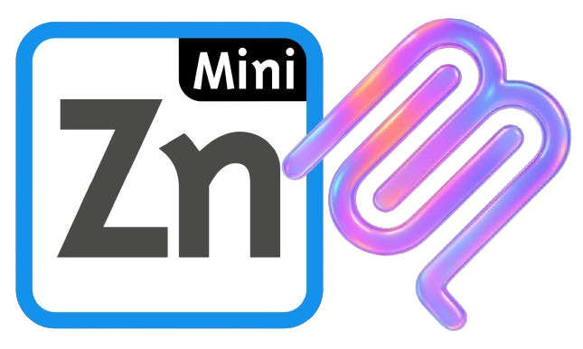
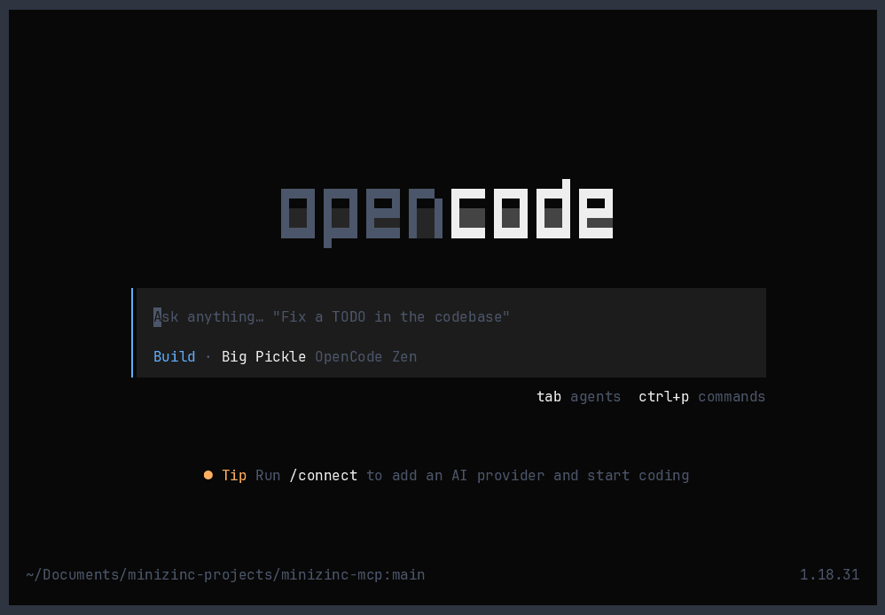

# MiniZinc MCP Server

<p align="center">
  
</p>

<div align="center">
  
  [](https://m8ven.ai/mcp/carban/minizinc-mcp)
  [](https://pypi.org/project/minizinc-mcp/)

</div>

An [MCP](https://modelcontextprotocol.io) server that exposes [MiniZinc](https://www.minizinc.org/) constraint solving and optimization to LLM clients such as opencode, Claude Desktop, and Cursor. It lets an agent parse, type-check, and solve MiniZinc models directly from a chat session.

Built with the [MCP Python SDK v2](https://py.sdk.modelcontextprotocol.io/) and the [MiniZinc Python binding](https://pypi.org/project/minizinc/).

---

## Demo

<p align="center">
  
</p>

## Install it

### 1. Prerequisites

Only two things need to be installed, **once per machine**:

- **[uv](https://docs.astral.sh/uv/)** — `curl -LsSf https://astral.sh/uv/install.sh | sh`
- **[MiniZinc](https://www.minizinc.org/)** 2.6+ with the `minizinc` executable on `PATH` (includes a default solver, Gecode)

Everything else is fetched automatically by `uv` — there is **no clone, no venv setup, and no manual `pip install`** on your side.

### 2. Install the server (pick one)

#### From PyPI (recommended)

Install the latest released version globally (best if you use it in several projects):

```sh
uv tool install minizinc-mcp
```

Or run the latest released version on demand, with nothing installed:

```sh
uvx minizinc-mcp
```

#### From GitHub (latest development version)

To run the latest development version directly from the repository, use:

```sh
uvx --from git+https://github.com/carban/minizinc-mcp minizinc-mcp
```

To install that development version globally instead:

```sh
uv tool install --from git+https://github.com/carban/minizinc-mcp minizinc-mcp
```

The GitHub installation tracks the repository's `main` branch; PyPI provides released versions.

### 3. Wire it into your MCP client

The server runs over stdio. Tell your MCP client to launch it:

**opencode — project level** (add this to `opencode.jsonc` in your project):

```jsonc
{
  "$schema": "https://opencode.ai/config.json",
  "mcp": {
    "minizinc": {
      "type": "local",
      "command": ["uvx", "minizinc-mcp"]
    }
  }
}
```

**opencode — global** (add the same `mcp.minizinc` block to `~/.config/opencode/opencode.json`):

```jsonc
{
  "mcp": {
    "minizinc": {
      "type": "local",
      "command": ["uvx", "minizinc-mcp"]
    }
  }
}
```

**Claude Desktop** (`claude_desktop_config.json`):

```json
{
  "mcpServers": {
    "minizinc": {
      "command": "uvx",
      "args": ["minizinc-mcp"]
    }
  }
}
```

If you are using the GitHub installation instead, replace `["uvx", "minizinc-mcp"]` in the opencode configuration with `["uvx", "--from", "git+https://github.com/carban/minizinc-mcp", "minizinc-mcp"]`, and replace the Claude Desktop arguments with `["--from", "git+https://github.com/carban/minizinc-mcp", "minizinc-mcp"]`.

### 4. Verify it works

Restart your client. Eight tools should now be available, prefixed with `minizinc_`:
- `minizinc_list_tools`
- `minizinc_list_solvers`
- `minizinc_validate_model`
- `minizinc_solve_model`
- `minizinc_compare_solvers`
- `minizinc_solve_model_by_path`
- `minizinc_get_model_info`
- `minizinc_get_flatzinc`

Quick sanity check — ask your client: _"list the available MiniZinc solvers"_. You should see `gecode`, `chuffed`, `highs`, and anything else installed on the machine.

---

## Using the MiniZinc skill with opencode

The [`skills/minizinc/`](skills/minizinc/SKILL.md) folder contains an opencode **skill** that steers an agent through constraint programming, combinatorial, and optimization work: modeling problems with MiniZinc, type-checking models, running or comparing solvers, and rendering results as Markdown tables (instead of raw JSON).

The skill lives in a top-level `skills/` folder so it is visible in the repo, but opencode does **not** auto-discover it from there — you must install it first.

### 1. Prerequisite

Register the MCP server as shown in the [Wire it into your MCP client](#3-wire-it-into-your-mcp-client) section above.

### 2. Install the skill (pick one)

Copy it into a project where you want it active (auto-discovered by opencode, no config needed):

```sh
cp -r skills/minizinc <your-project>/.opencode/skills/
```

Or install it globally so it is available in every project:

```sh
cp -r skills/minizinc ~/.config/opencode/skills/
```

Or point opencode at this repo's `skills/` folder (scanned recursively for `SKILL.md`) by adding to `opencode.json`:

```jsonc
{
  "$schema": "https://opencode.ai/config.json",
  "skills": {
    "paths": ["/path/to/minizinc-mcp/skills"]
  }
}
```

Claude Code users can copy the folder to `~/.claude/skills/minizinc/` instead of `~/.config/opencode/skills/`.

### 3. Use it

Restart your client, then simply describe a problem. For example:

- _"Solve this knapsack as a MiniZinc model."_
- _"Optimize a production schedule with MiniZinc."_
- _"Compare the available solvers on this model and recommend one."_
- _"Write a MiniZinc model for this timetabling problem and check it."_

The skill activates automatically and drives the `minizinc_*` tools — modeling, validating, solving, comparing solvers, and presenting results as tables.

---

## What it does

| Tool | Description |
|---|---|
| `list_tools` | Lists the names of all tools exposed by this MiniZinc MCP server, including `list_tools` itself. |
| `list_solvers` | Lists every MiniZinc solver installed on the machine. The returned tag names (e.g. `gecode`, `chuffed`, `highs`) can be passed to `solve_model`. |
| `validate_model` | Parses and type-checks MiniZinc model code **without solving it**. Useful for checking model syntax up front. Returns `VALID` or `INVALID` with an error message. |
| `solve_model` | Solves a MiniZinc model given as source code: once, exhaustively (`all_solutions`), or with a solution / time limit. Returns the status, solution(s), objective value (for optimization problems), and solver statistics. |
| `compare_solvers` | Solves the same model once with each requested solver and returns the individual `solve_model` results keyed by solver name. Use this for solver comparisons and performance evaluation. |
| `solve_model_by_path` | Same as `solve_model` but loads the model and its optional data (`.dzn`) file from paths instead of source code. |
| `get_model_info` | Inspects a model **without solving it**: returns its solve method (satisfy/minimize/maximize) and the declared input parameters and output variables with their types. Useful for an agent to know exactly which `params` a model expects. |
| `get_flatzinc` | Compiles a model (and optional data) to FlatZinc text without solving it. Returns the `.fzn` model, the `.ozn` output model, and flattening statistics. Useful for debugging and low-level inspection. |

### `solve_model` arguments

| Argument | Type | Default | Description |
|---|---|---|---|
| `model_code` | `str` | (required) | The MiniZinc source code (`.mzn`) of the model. |
| `params` | `dict \| str` | `None` | Parameter assignments like a `.dzn` file: a JSON object mapping names to values (a JSON string encoding such an object is also accepted). |
| `solver` | `str` | `"gecode"` | Which solver to use (see `list_solvers`). |
| `all_solutions` | `bool` | `False` | Compute all solutions of a `solve satisfy` problem. |
| `max_solutions` | `int \| None` | `None` | Stop after at most this many solutions. |
| `timeout_seconds` | `int \| None` | `None` | Solver time limit in seconds. |

### `compare_solvers` arguments

| Argument | Type | Default | Description |
|---|---|---|---|
| `model_code` | `str` | (required) | The same MiniZinc source model to pass to every solver. |
| `solvers` | `list[str]` | (required) | Solver tag names to run, normally from `list_solvers`. |
| `params` | `dict \| None` | `None` | The same parameter assignments to pass to every solver. |
| `all_solutions` | `bool` | `False` | Compute all solutions of a `solve satisfy` problem with every solver. |
| `max_solutions` | `int \| None` | `None` | Stop each solver after finding at most this many solutions. |
| `timeout_seconds` | `int \| None` | `None` | Per-solver time limit in seconds. |

`compare_solvers` calls `solve_model` once per requested solver and returns each result under `results`, keyed by solver name. A solver error is retained in that solver's result without stopping the remaining runs. The shape is:

```json
{
  "results": {
    "gecode": {
      "status": "OPTIMAL_SOLUTION",
      "objective": 1700,
      "statistics": { "time": 0.01, "nodes": 12 }
    },
    "chuffed": {
      "status": "OPTIMAL_SOLUTION",
      "objective": 1700,
      "statistics": { "time": 0.02, "nodes": 8 }
    }
  }
}
```

The `solve_model` result is a JSON object like:

```json
{
  "status": "OPTIMAL_SOLUTION",
  "objective": 9,
  "solution": { "objective": 9, "x": 9, "y": 1 },
  "statistics": { "time": 0.204, "nodes": 3, ... }
}
```

`status` is one of `SATISFIED`, `OPTIMAL_SOLUTION`, `ALL_SOLUTIONS`, `UNSATISFIABLE`, `UNKNOWN`, or `ERROR`. `validate_model`, `solve_model`, and each individual `compare_solvers` run never raise in normal operation — errors are returned inside the result dict.

The tool descriptions also instruct the client agent to present solving results, solver comparisons, and model info to you as Markdown tables instead of raw JSON, so `solve_model` and `compare_solvers` answers read like tables even though the tools themselves always return structured JSON.

---

## Developing locally

Clone the repo, then:

```sh
uv sync          # create the environment and install mcp + minizinc
```

The server speaks the MCP **stdio** transport, so it is launched as a subprocess by an MCP client. Run it with the SDK inspector:

```sh
uv run mcp dev server.py
```

that opens the MCP Inspector in the browser where every tool can be called interactively. A minimal programmatic smoke test:

```sh
uv run python -c "
import asyncio
from mcp import Client
from mcp.client.stdio import StdioServerParameters

async def main():
    params = StdioServerParameters(command='uv', args=['run', 'python', 'server.py'], cwd='.')
    async with Client(params) as client:
        result = await client.call_tool('solve_model', {
            'model_code': 'var 1..10: x; var 1..10: y; constraint x + y = 10; solve maximize x;'
        })
        print(result.content[0].text)

asyncio.run(main())
"
```

## Running the tests

Install the test dependencies, then run the suite:

```sh
uv sync --group dev
uv run pytest -q
```

The tests in `tests/` launch the server end-to-end over stdio and call every tool through the MCP protocol, solving the example model in `example/`. They need a working [MiniZinc](https://www.minizinc.org/) install (the same prerequisite as for developers).

## Notes and limitations

- `params` follows JSON representation: JSON arrays map to MiniZinc arrays; numbers, strings, and booleans map to their native MiniZinc types. Exotic types like sets and enums are not fully expressible this way.
- Do not combine `all_solutions` with `max_solutions`; the MiniZinc driver rejects the combination.
- MiniZinc requires a solver that supports the model (e.g. `chuffed`/`gecode` for CP, `highs`/`cbc` for MIP models). Use `list_solvers` to see what is installed.
- Solutions are returned inline in the tool result; `read_only_hint` is set on all tools, so they do not modify your files or system.
